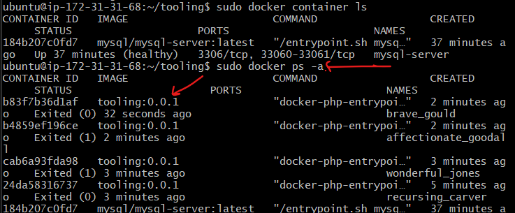
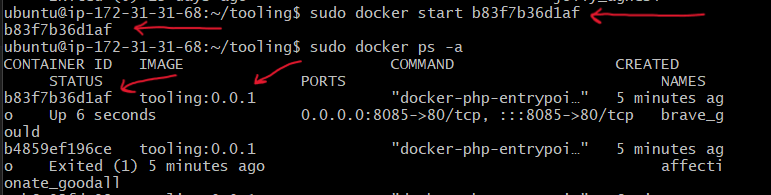
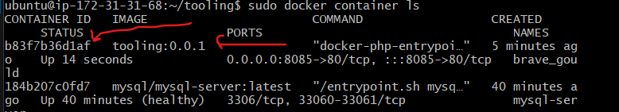

# Migration To The Cloud With Containerization 1 - Docker

**Step 0 - Prerequisites**
---

- Install Docker.

*As of the time of this doc, Docker is having some issues being deployed on RHEL servers. Use ubuntu instead.*

*Docker installation steps can be found [here](https://docs.docker.com/engine/install/ubuntu/)*

**Step 1 - Creating MySQL Container For Tooling App Backend**
---

- Create a network dedicated for the MySQL database and tooling application we would containerize on docker.

*The docker network allows artifacts in that network communicate with each other*

```
docker network create --subnet=172.18.0.0/24 app_network_tooling
```

- After the network has been created, create an environment variable that would be used to store the root user password. Run `export MYSQL_PW=<yourPassword>`.

- Run the command below to pull the MySQL image and run the container.

```
docker run --network app_network_tooling -h mysqlserverhost --name=mysql-server -e MYSQL_ROOT_PASSWORD=$MYSQL_PW -d mysql/mysql-server:latest
```

- Run `docker ps -a` to verify if the container was created.


- Create a file called `create user.sql`, which will host a command to create a user. This is done because it is not advisable to connect to MySQL server remotely using root. See command below:

```
create user '<username>'@'%' identified by '<password>';
grant all privileges on *.* to 'vergil'@'%';
```

- Run the above script to create the new user.

```
docker exec -i mysql-server mysql -uroot -p$MYSQL_PW < create_user.sql
```

- Connect to the MySQL server from a second container running the MySQL client utility.

```
docker run --network app_network_tooling --name mysql-client -it --rm mysql mysql -h mysqlserverhost -uvergil -p
```

*For some reason, I'm unable to connect if I do `-u rooot`. It only works when I do -uroot.*


**Step 2 - Prepping The Database Schema**
---

- Clone the tooling app repo from `https://github.com/darey-devops/tooling.git`.

- Locate the `tooling_db_schema.sql` file inside the newly cloned tooling folder and export the location.

```
export tooling_db_schema=~/tooling_db_schema.sql
```

- Run the SQL script against the SQL container to create the database and prepare the schema.

```
docker exec -i mysql-server mysql -uroot -p$MYSQL_PW < $tooling_db_schema
```

**Step 3 - Running The Tooling App**
---

- Go to the tooling app directory and locate the Dockerfile. Open it and modify the ENV details to match the correct database credentials. See sample below.

```
MYSQL_IP=mysqlserverhost
MYSQL_USER=<username>
MYSQL_PASS=<password>
MYSQL_DBNAME=toolingdb
```

- After the above is done, build the image by running `docker build -t tooling:0.0.1 .` *This command builds the docker image, gives it a name, a version tag and uses this current directory for the build, hence the .*

- After the build completes, run the container by using the following command.

```
docker run --network app_network_tooling -p 8085:80 -it tooling:0.0.1
```

- After the above command is run, check the running containers by doing a `docker container ls`. The container we're looking for (tooling) would most likely be absent from the list. In that case, run `docker ps -a` to see tooling.



- Run the following command to start the tooling container. Take note of the container ID from the above screenshot.

```
docker start <containerId>
```



- Run `docker container ls` to confirm if container is running.




